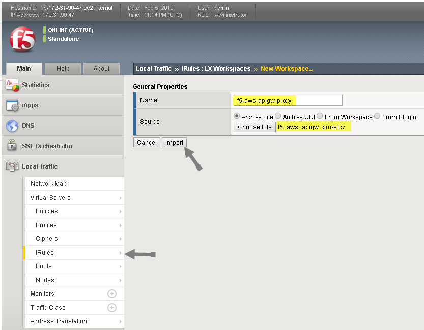

# F5 AWS API Gateway Proxy iRules LX Plug-in

## Introduction

The f5_aws_apigw_proxy iRules LX plug-in is a BIG-IP iRules LX plugin for enables the BIG-IP to act as a many-to-one API proxy for AWS API Gateway requests.  The plug-in utilizes a data-group to perform  

For example:  POST/api.f5demo.net/<b>api1</b>  -- proxies to -- POST/jbfipbsqfa.execute-api.us-east-1.amazonaws.com/<b>prod/LambdaPub-WCGIBYB9AHI</b>
          POST/api.f5demo.net/<b>ap2</B>  -- proxies to -- POST/jbfipbsqfa.execute-api.us-east-1.amazonaws.com/<b>prod/lambdafn-WTGH67</b>

This extension is community supported.

## Requirements

BIG-IP VE 13.1 or later running on EC2

## Installation

1. Download and import [.tgz](https://github.com/gregcoward/f5-aws-apigw-proxy/releases/download/1.0.0/f5_aws_apigw_proxy.tgz) file into the BIGIP, (see below). 
 
2. Create LX plugin from imported workspace   -  //Note: must be named 'f5_aws_apigw_proxy'
	
	TMSH command example: tmsh create ilx plugin f5_aws_apigw_proxy from-workspace f5_aws_apigw_proxy  //Note: must be named 'f5_aws_apigw_proxy'

3. Create and populate the data-group  //Note: must be named 'aws-apis'
	
	TMSH command example: tmsh create ltm data-group internal aws-apis type string records add { api1 { data jbfipbsqfa.execute-api.us-east-1.amazonaws.com/default/serverlessrepo-glc-publisher-LambdaPublisher-WFCGIBYB9AHI }}

For a quick video run through of the installation process, check out this [video](https://www.youtube.com/watch?v=lY-LQtkKu0o).
## Modification

</body>	
</HTML>