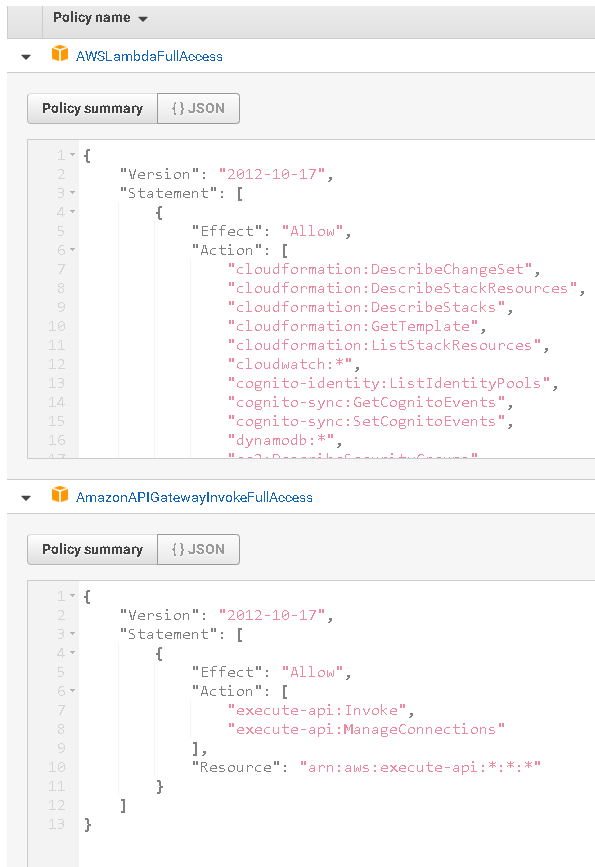

# F5 AWS Lambda/API Gateway Proxy iRules LX Plug-in

## Introduction

<b><i>**This extension is community supported.**</i></b>

The f5_aws_apigw_proxy iRules LX plug-in is a BIG-IP iRules LX plugin for enables the BIG-IP to act as a many-to-one proxy for both AWS API Gateway and direct Lambda function requests.  The plug-in utilizes a data-group to perform path/URI and path/LambdaFunction matching.  This allows for a single public facing proxy endpoint to service multiple backend AWS Lambda functions and APIs.

### Lambda Proxy
To proxy a Lambda function located within the same region as the F5 BIG-IP instance, create a datagroup, (<i>'aws-apis'</i>)to create path/fxn mappings  <i>fxn1 ---> glc-hello-function</i> 

 To proxy a Lambda function located in a different AWS region simplye prepend the region to the request <i>fxn1 ---> glc-hello-function</i> path --> region/LambdFunctionName   

<b><i>Lambda Proxy Example1:</b></i> POST/apigw.f5demo.net/<b>fxn1</b>  -- proxies directly to the Lambda function with the name <b>glc-hello-function</b>

<b><i>Lambda Proxy outsid of region Example2:</b></i> POST/apigw.f5demo.net/<b>fxn2</b>  -- proxies directly to the Lambda function with the region/name <b>eu-west-2/glc-hello-function</b>

### AWS API Proxy
To proxy AWS APIs, use the same datagroup to create path --> URI matchings -   <i>api1 ---> jbfipbsqfa.execute-api.us-east-1.amazonaws.com/prod/LambdaPub-WCGIBYB9AHI</i>      

<b><i>API example:</b></i> POST/apigw.f5demo.net/<b>api1</b>  -- proxies to -- POST/<b>jbfipbsqfa.execute-api.us-east-1.amazonaws.com/prod/LambdaPub-WCGIBYB9AHI</b>
        
## Requirements

BIG-IP VE 13.1 or later running on EC2

## Installation

<b>1.</b> Download and import [.tgz](https://github.com/gregcoward/f5-aws-apigw-proxy/releases/download/1.0.0/f5_aws_apigw_proxy.tgz) file into the BIGIP, (see below). 
  
   

  <b>2.</b> Create LX plugin from imported workspace   -  <b>Note:</b> must be named 'f5_aws_apigw_proxy'
  <b>TMSH command example:</b> <i>tmsh create ilx plugin f5_aws_apigw_proxy from-workspace f5_aws_apigw_proxy</i>
  

  <b>3.</b> Create and populate the data-group  //Note: must be named 'aws-apis'
  <b>TMSH command example:</b> <i>tmsh create ltm data-group internal aws-apis type string records add { api1 { data jbfipbsqfa.execute-api.us-east-1.amazonaws.com/default/serverlessrepo-glc-publisher-LambdaPublisher-WFCGIBYB9AHI } fxn1 { data glc-hello-fxn }}</i>

  <b>4.</b> Create an AWS IAM role with the name:  <b><i>f5ApiProxyRole</i></b>    The role requires, at a minimum the '<i>AmazonAPIGatewayInvokeFullAccess</i>' and '<i>AWSLambdaFullAccess</i>' permissions, (see below).  Attach the newly created role to BIG-IP ec2 instance. Refer to this [link](https://aws.amazon.com/blogs/security/easily-replace-or-attach-an-iam-role-to-an-existing-ec2-instance-by-using-the-ec2-console/) for instructions. 
    
For a quick video run through of the installation process, check out this [video](https://www.youtube.com/watch?v=lY-LQtkKu0o).

## Modification 

Once the workspace has been installed, you can use the BIG-IP workspace, (see below) to view and modify the underlying iRule -tcl  and the nodejs processor
  

</body>	
</HTML>
