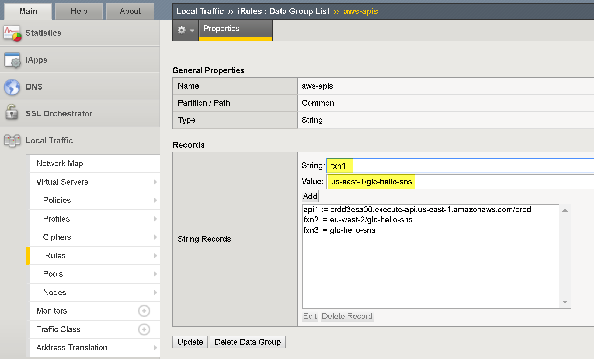

# F5 AWS API Gateway Proxy iRules LX Plug-in

## Introduction

The f5_aws_apigw_proxy iRules LX plug-in is a BIG-IP iRules LX plugin for enables the BIG-IP to act as a many-to-one API proxy for AWS API Gateway requests.  The plug-in utilizes a data-group to perform path - to URI matching.  This allows for a single public facing proxy endpoint to service multiple backend AWS APIs.

For example:  POST/api.f5demo.net/<b>api1</b>  -- proxies to -- POST/jbfipbsqfa.execute-api.us-east-1.amazonaws.com/<b>prod/LambdaPub-WCGIBYB9AHI</b>
          POST/api.f5demo.net/<b>ap2</B>  -- proxies to -- POST/jbfipbsqfa.execute-api.us-east-1.amazonaws.com/<b>prod/lambdafn-WTGH67</b>

This extension is community supported.

## Requirements

BIG-IP VE 13.1 or later running on EC2

## Installation

<b>1.</b> Download and import [.tgz](https://github.com/gregcoward/f5-aws-apigw-proxy/releases/download/1.0.0/f5_aws_apigw_proxy.tgz) file into the BIGIP, (see below). 
  
   

<b>2.</b> Create LX plugin from imported workspace   -  <b>Note:</b> must be named 'f5_aws_apigw_proxy'
 <b>TMSH command example:</b> <i>tmsh create ilx plugin f5_aws_apigw_proxy from-workspace f5_aws_apigw_proxy</i>
  
  

<b>3.</b> Create and populate the data-group  //Note: must be named 'aws-apis'
<b>TMSH command example:</b> <i>tmsh create ltm data-group internal aws-apis type string records add { api1 { data jbfipbsqfa.execute-api.us-east-1.amazonaws.com/default/serverlessrepo-glc-publisher-LambdaPublisher-WFCGIBYB9AHI }}</i>

<b>4.</b> Create an AWS IAM role with the name:  <b><i>f5ApiProxyRole</i><b>  The role requires, at a minimum the '<i>AmazonAPIGatewayInvokeFullAccess</i>' permission, (see below).  Attach the newly created role to BIG-IP ec2 instance. Refer to this [link](https://aws.amazon.com/blogs/security/easily-replace-or-attach-an-iam-role-to-an-existing-ec2-instance-by-using-the-ec2-console/) for instructions. 

  
For a quick video run through of the installation process, check out this [video](https://www.youtube.com/watch?v=lY-LQtkKu0o).

## Modification 
Once the workspace has been installed, you can use the BIG-IP workspace, (see below) to view and modify the underlying iRule -tcl  and the nodejs processor
 

</body>	
</HTML>